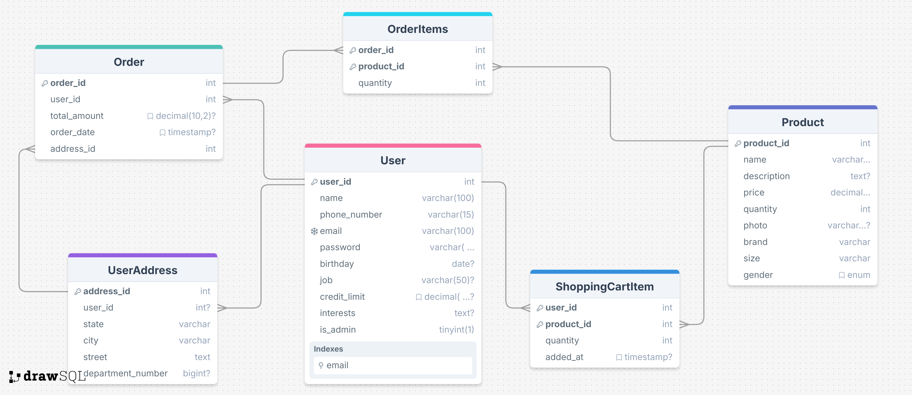

  

# MISK Perfumes – E-Commerce Web Application

**MISK Perfumes** is a full-stack e-commerce web application developed for perfume enthusiasts. It offers a smooth and elegant online shopping experience, allowing customers to browse, filter, and purchase perfumes, while admins manage products and orders through a secure dashboard.

---
## Project Overview  
**MISK Perfumes** is a web-based e-commerce application designed for selling perfumes online. The platform allows users to browse perfumes, add items to their shopping cart, and complete purchases within their credit limit. The system includes user authentication, profile management, and an admin interface for managing inventory and customer profiles.  

---

## Features  

### 👤 User Features  
- User registration and authentication (sign up, login, logout)  
- Profile management (update personal details, credit limit)  
- Browse and search perfumes (filter by category and price)  
- Shopping cart functionality (add, remove, update items)  
- Purchase perfumes with credit limit restrictions  
- Order history tracking  
- Responsive and mobile-friendly design  

### 🛠️ Admin Features  
- Manage perfume inventory (add, edit, delete perfumes)  
- Update perfume prices and stock quantities  
- View and manage customer profiles  
- Review customer order history  

### ⚙️ Technical Features  
- Client-side validation for user inputs  
- Asynchronous operations (AJAX) for:  
  - Checking username availability during registration  
  - Shopping cart interactions (add, update, remove items)  
- Object-Relational Mapping (ORM) with connection pooling  
- Secure authentication and authorization  
- Optimized database queries for better performance  

---

## 💻 Technologies Used  

### Frontend  
- HTML5, CSS3, Bootstrap   
- JavaScript, jQuery  

### Backend  
- Java Servlets, JSP (Jakarta EE)
- Apache Tomcat 10 

### Database  
- MySQL  
- JDBC + Hibernate ORM

### Build Tool  
- Maven

---
## 🗃️ Database Schema

  

✓ Shows tables for Users, Products, Orders, and OrderItems with relationships.

---

## Contributers
- [**Ahmad Taher**](https://github.com/AhmadTaher1)  
- [**Ghaidaa Eldsoky**](https://github.com/ghaidaaeldsoky)  
- [**Sama Mohamed**](https://github.com/sama-kamel2462)
